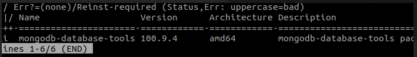

# MongoDB Exercise 

**Exercise 1**

Create a collection to store information about your favourite films. Add appropriate validation rules, then insert at least 3 documents. Practice using both .insertOne() and .insertMany(). You may want to type commands into a text editor then paste into the shell.

- **Validation rules**
```commandline
{
  $jsonSchema: {
    bsonType: 'object',
    required: [
      'title',
      'release_date',
      'genre',
      'rating',
      'classification'
    ],
    properties: {
      title: {
        bsonType: 'string'
      },
      release_date: {
        bsonType: 'date',
        description: 'format must be YYYY-MM-DD '
      },
      genre: {
        bsonType: [
          'array',
          'string'
        ]
      },
      rating: {
        bsonType: 'int'
      },
      classfication: {
        bsonType: 'string'
      }
    }
  }
}


>>> db.film.insertOne({ 
                        title : "The Devil Wears Prada", 
                        release_date: ISODate("2006-10-05"), 
                        genre: ["comedy", "musical"], 
                        rating:4, 
                        classification:"PG"
                      })
>>> db.film.insertMany([{ 
                        title : "Avatar", 
                        release_date: ISODate("2009-12-18"), 
                        genre: ["SF", "Action"], 
                        rating:4, 
                        classification:"12A"
                      },
                      {title : "Face off", 
                        release_date: ISODate("1997-11-07"), 
                        genre: ["Action", "Drama"], 
                        rating:3, 
                        classification: "18"
                        }
                      ])
```


Exercise 2

Add a new document to the collection, add a new field to that document, remove that field and then remove the document entirely.
```commandline
db.film.insertOne({ 
                        title : "to be deleted", 
                        release_date: ISODate("2006-10-05"), 
                        genre: ["comedy", "musical"], 
                        rating:2, 
                        classification:"PG"
                      })
 
db.film.update_one({
                        "title": "to be deleted"} , {"$set": {"title" : "updated to be deleted"}})
db.film.deleteOne({
                        "title": "updated to be deleted"})

```

Exercise 3

Install mongotools. Add the path to it's bin folder to the PATH variable (will be inside MongoDB folder)
```commandline
sudo dpkg -l mongodb-database-tools
```


Exercise 4

Download StarWars.zip. Extract it in a reasonable location. In the terminal (not mongosh) navigate to the folder, make sure it is the one that has all of the json file. Then run the following command to add each to a new db called "starwars"
```
for i in *.json; do
    mongoimport --db starwars --collection characters --jsonArray --file "$i"
```

Exercise 5

Write a query that finds the Luke Skywalker document

Return the value of name and eye_colour only, from the "chewbacca" document

Find a way to check the species name of admiral ackbar, this is in an embedded document ("Species")
```commandline
>>> use starwars
>>> db.characters.findOne({ name: "Luke Skywalker"})
>>> db.characters.find({name: "Chewbacca"}, {name: 1, eye_color: 1 })
>>> db.characters.findOne({name: "Ackbar"}, {name: 1, "species.name": 1})
```
Exercise 6 

Write a query that gives us only the names + homeworld names of humans in the database?

# Mongodb Advanced exercises

Exercise 1

Research aggregation in Mongodb. How does it work?
Example: Aggregation to Find the Average Age of Users Grouped by Country

Assume you have a collection named `users` with documents like the following:
```json
{
  "name": "Alice",
  "age": 25,
  "country": "USA"
}
```

#### Step-by-Step Instructions:

1. **Match Stage**: Filter documents to include only those that match specific criteria (optional). For instance, to include only users from specific countries:
   ```json
   {
     $match: {
       "country": { $in: ["USA", "Canada", "UK"] }
     }
   }
   ```

2. **Group Stage**: Group the documents by `country` and calculate the average age for each country:
   ```json
   {
     $group: {
       "_id": "$country",
       "averageAge": { $avg: "$age" }
     }
   }
   ```

3. **Sort Stage**: Optionally, sort the results by `averageAge` in descending order:
   ```json
   {
     $sort: {
       "averageAge": -1
     }
   }
   ```

#### Adding Stages in MongoDB Compass:

- **Match Stage**: Click on "Add Stage" and select `$match`. Enter the JSON code for the match stage:
  ```json
  {
    "country": { "$in": ["USA", "Canada", "UK"] }
  }
  ```

- **Group Stage**: Click on "Add Stage" again and select `$group`. Enter the JSON code for the group stage:
  ```json
  {
    "_id": "$country",
    "averageAge": { "$avg": "$age" }
  }
  ```

- **Sort Stage**: Click on "Add Stage" again and select `$sort`. Enter the JSON code for the sort stage:
  ```json
  {
    "averageAge": -1
  }
  ```

4. **Run the Aggregation**: Click on the "Run" button to execute the aggregation pipeline. MongoDB Compass will display the results of the aggregation.

### Example Pipeline in MongoDB Compass
Here is how the complete aggregation pipeline would look in MongoDB Compass:

```json
[
  {
    $match: {
      "country": { $in: ["USA", "Canada", "UK"] }
    }
  },
  {
    $group: {
      "_id": "$country",
      "averageAge": { $avg: "$age" }
    }
  },
  {
    $sort: {
      "averageAge": -1
    }
  }
]
```

MongoDB provides various aggregation functions that you can use within the `$group` stage or other appropriate stages of an aggregation pipeline. Here are some of the most commonly used aggregation functions:

### Aggregation Functions

1. **$sum**
   - Sums up the values for a group of documents.
   ```json
   {
     $group: {
       "_id": "$category",
       "totalAmount": { $sum: "$amount" }
     }
   }
   ```


2. **$avg**
   - Calculates the average of the numeric values for a group of documents.
   ```json
   {
     $group: {
       "_id": "$category",
       "averageAmount": { $avg: "$amount" }
     }
   }
   ```

3. **$min**
   - Returns the minimum value from a group of documents.
   ```json
   {
     $group: {
       "_id": "$category",
       "minAmount": { $min: "$amount" }
     }
   }
   ```

4. **$max**
   - Returns the maximum value from a group of documents.
   ```json
   {
     $group: {
       "_id": "$category",
       "maxAmount": { $max: "$amount" }
     }
   }
   ```

5. **$push**
   - Adds values to an array in the resulting document for each group.
   ```json
   {
     $group: {
       "_id": "$category",
       "amounts": { $push: "$amount" }
     }
   }
   ```

6. **$addToSet**
   - Adds unique values to an array in the resulting document for each group.
   ```json
   {
     $group: {
       "_id": "$category",
       "uniqueAmounts": { $addToSet: "$amount" }
     }
   }
   ```

7. **$first**
   - Returns the first value in each group.
   ```json
   {
     $group: {
       "_id": "$category",
       "firstAmount": { $first: "$amount" }
     }
   }
   ```

8. **$last**
   - Returns the last value in each group.
   ```json
   {
     $group: {
       "_id": "$category",
       "lastAmount": { $last: "$amount" }
     }
   }
   ```

9. **$count**
   - Returns the count of documents in each group.
   ```json
   {
     $group: {
       "_id": "$category",
       "count": { $sum: 1 }
     }
   }
   ```

### Example of Using Multiple Aggregation Functions

Here’s an example aggregation pipeline that uses several of these functions:

```json
[
  {
    $group: {
      "_id": "$category",
      "totalAmount": { $sum: "$amount" },
      "averageAmount": { $avg: "$amount" },
      "minAmount": { $min: "$amount" },
      "maxAmount": { $max: "$amount" },
      "amounts": { $push: "$amount" },
      "uniqueAmounts": { $addToSet: "$amount" },
      "firstAmount": { $first: "$amount" },
      "lastAmount": { $last: "$amount" },
      "count": { $sum: 1 }
    }
  }
]
```

#### Example in MongoDB Compass
To calculate the total amount and average amount per category, you would:
1. Click "Add Stage" and choose `$group`.
2. Enter the following JSON:

```json
{
  "_id": "$category",
  "totalAmount": { "$sum": "$amount" },
  "averageAmount": { "$avg": "$amount" }
}
```


-   Write a query that finds the total (sum) of the height of all human characters in the db
```commandline
>>> db.characters.aggregate([
  {
    $match: {
      "species.name": "Human",
      "height": { $ne: "unknown" } // ignore "unknown" 
    }
  },
  {
    $group: {
      "_id": "$species.name",
      "totalSum": { $sum: { $toInt: "$height" } } // ##convert height to int
    }
  }
])
```
-   Write a query that finds the max height per homeworld
```
db.characters.aggregate([
  {
    $match: {
      "height": { $ne: "unknown" } // ignore "unknown" 
    }
  },
  {
    $group: {
      "_id": "$homeworld.name",
      "maxamout": { $max: { $toInt: "$height" } } // ##convert height to int
    }
  }
])
```

-   Write a query that finds the mass and count per species. Filter out null values and sort by average mass (ascending order)
```commandline
db.characters.aggregate([
{
    $match: {
      "mass": { $ne: "unknown" } // ignore "unknown" 
    }
  },
  {
    $project: {
      "species.name": 1,
      "mass": {
        $toDouble: {
          $replaceAll: {
            input: "$mass",
            find: ",",
            replacement: ""
          }
        }
      }
    }
  },
  {
    $group: {
      "_id": "$species.name",
      "count": { $sum: 1 },
      "total_mass": { $sum: { $toDouble: "$mass" } },
      "average_mass": { $avg: "$mass" }
    }
    },
    
    
    {
    $sort: {
    "average_mass" : 1
    }
    }
])

```